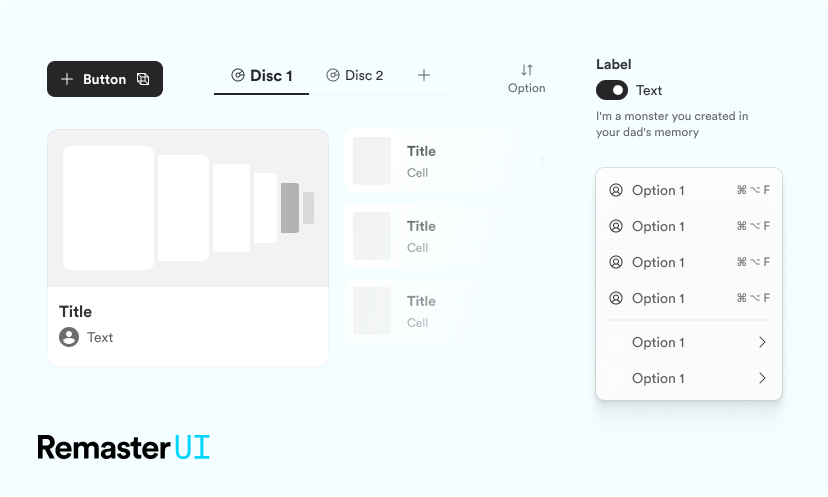

# Remaster UI

Remaster UI is a module that provides a set of React components built with [@emotion](https://emotion.sh/docs/styled) to help you build beautiful user interfaces.

This package includes components, icons (by Phosphor) & tokens.

## Installation

```bash
npm i remaster-ui @phosphor-icons/react
```

## How to use

```tsx
import { ActionButton } from 'remaster-ui'
import { Heart } from '@phosphor-icons/react'

export default Page() {
  return <ActionButton variant="primary" text="Button" leading={<Heart />} />
}
```

## Credits

- [facebook/react](https://github.com/facebook/react)
- [emotion-js/emotion](https://github.com/emotion-js/emotion)
- [phosphor-icons/react](https://github.com/phosphor-icons/react)
- [Hacker0x01/react-datepicker](https://github.com/Hacker0x01/react-datepicker)
- [pmndrs/react-spring](https://github.com/pmndrs/react-spring)
- [henperi/image-validator](https://github.com/henperi/image-validator)
- [hjortureh/css3.coverflow](https://github.com/hjortureh/css3.coverflow)

## Storybook

```bash
npm run storybook
```

## License

Licensed under the [GNU General Public License v3.0](./LICENSE).
